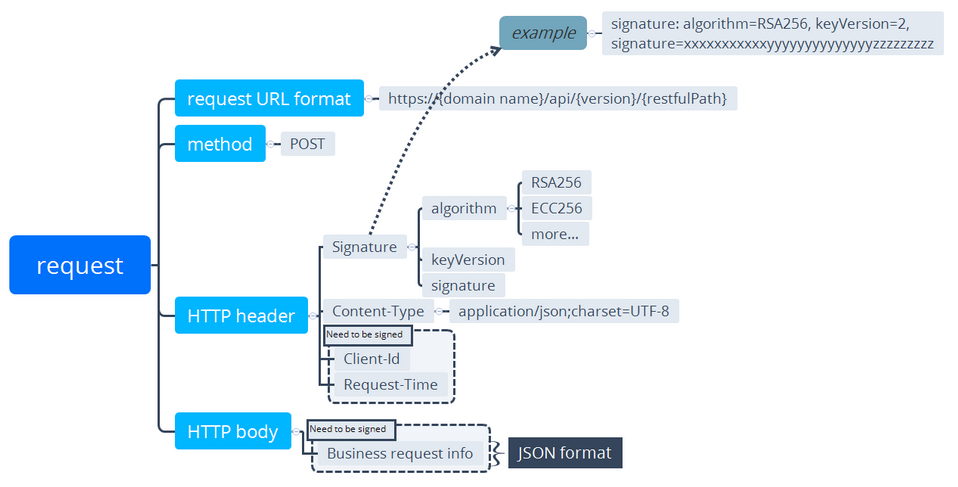
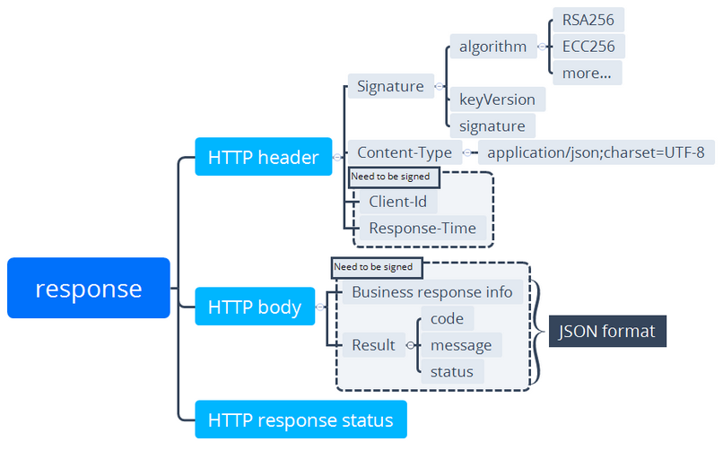

#  Descripción general

Los mini programs ofrecen un conjunto de OpenAPIS para lograr diversas capacidades, por ejemplo, la capacidad de pago. Puede usar el método de publicación para enviar solicitudes HTTPS y recibir respuestas en consecuencia.

La siguiente sección introduce principalmente la estructura del mensaje y el flujo de trabajo de transmisión de mensajes de extremo a extremo.

## Versionamiento
La versión API actual es ```V2```. La versión se especifica en la URL.Por ejemplo:

```https://{host}/api/open/v2/payments/pay```.

## Estructura de mensajes

Antes de hacer cualquier solicitud, es importante comprender cómo funciona OpenApi y cómo se estructuran las solicitudes y respuestas. Esta sección presenta información general (como estructura de mensajes, campos de mensajes y transmisión de mensajes) de los mensajes en línea entre su sistema y el backend de la billetera.

## Estructura de solicitud (Request) 

La siguiente figura ilustra la estructura de solicitud.



## Solicitar URL 

La URL de solicitud es: ```https://{host}/api/open/{restful_path}```, que tiene la siguiente estructura:

<ul>
    <li>
        **host:** Incluye el host que es el nombre de dominio estándar asignado por el backend de la billetera.
    </li>
    <li>
        **resful_path:** es la ruta a la interfaz, por ejemplo, ```/{version}/payments/pay```
        * **version:**  es la versión de Open API, por ejemploe, ```v1``` or ```v2```. 
    </li>
</ul>

Una interfaz puede identificarse de manera única por ```restful_path```. Por ejemplo, el ```/v1/payments/pay``` es diferente de ```/v2/payments/pay```.


## Método de solicitud (method)

POST El método se utiliza para hacer una solicitud HTTP. 

## Encabezado de solicitud (Header)

El encabezado de solicitud contiene principalmente los siguientes campos.

* Nota: Los nombres de campo son insensibles al caso.

<table>
  <thead>
    <tr>
      <th>Header</th>
      <th>Required</th>
      <th>Code sample </th>
    </tr>
  </thead>
  <tbody>
    <tr>
      <td>Signature</td>
      <td>Yes</td>
      <td>```Signature: algorithm=RSA256, keyVersion=1, signature=****```</td>
    </tr>
    <tr>
      <td>Content-Type</td>
      <td>No</td>
      <td>```Content-Type: application/json; charset=UTF-8```</td>
    </tr>
    <tr>
      <td>Client-Id</td>
      <td>Yes</td>
      <td>```Client-Id: ****```</td>
    </tr>
    <tr>
      <td>Request-Time</td>
      <td>Yes</td>
      <td>```Request-Time: 2019-04-04T12:08:56.253+05:30```</td>
    </tr>
  </tbody>
</table>
              
For details of each header field, see the following description. 

## Firma

La firma contiene pares de valor clave que están separados por coma (,).Cada par de valores clave es una ecuación, que es una clave unida con su valor con un signo igual (=).

Se pueden configurar las siguientes claves:

    * **Algoritmo:** Especifica el algoritmo de firma digital que se utiliza para generar la firma. El valor no es sensible al caso.RSA256 y ECC224 son compatibles, y RSA256 es por defecto.
    * **Versión de clave:** Especifica la versión clave que se utiliza para generar o validar la firma.Por defecto, el valor es la última versión de la clave asociada con el ID Client.
    * **Firma:** Contiene el valor de firma de la respuesta.

Example:

<table>
    <thead>
        <tr>
        <td>
            Signature: algorithm=RSA256, keyVersion=1,
            signature=KEhXthj4bxxxJ801Hqw8kaLvEKc0Rii8KsNUazw7kZgjxyGSPuOZ48058UVJUkkR21iD9JkHBGR
            rWiHPae8ZRPuBagh2H3qu7fxY5GxVDWayJUhUYkr9m%2FOW4UQVmXaQ9yn%2Fw2dCtzwAW0htPHYrKMyrT
            pMk%2BfDDmRflA%2FAMJhQ71yeyhufIA2PCJV8%2FCMOa46303A0WHhH0YPJ9%2FI0UeLVMWlJ1XcBo3Jr
            bRFvcowQwt0lP1XkoPmSLGpBevxxxDE8%2FQ9WnxjPNDfrHnKgV2fp0hpMKVXNM%2BrLHNyMv3MkHg9iTMOD%
            2FFYDAwSd%2B6%xxxx
        </td>
        </tr>
    </thead>
</table>


## Content-Type (Optional)

Content-Type Indica el tipo de medio del cuerpo de la solicitud, según lo definido por RFC2616.En el cual, Charset se usa para generar/validar la firma.

Por ejemplo

<table>
    <thead>
        <tr>
        <td>
            Content-Type: application/json; charset=UTF-8
        </td>
        </tr>
    </thead>
</table>


## Cuerpo de solicitud (Request body)

El cuerpo de solicitud contiene la información de solicitud detallada en formato JSON.Los campos encerrados en el cuerpo de solicitud varían según los servicios.Para obtener más información, consulte el documento específico de especificación API. 

## Estructura de respuesta (Response structure)

Las siguientes figuras ilustran la estructura de respuesta:




## Encabezado de respuesta (Response header)

El encabezado de respuesta lleva la información sobre la respuesta, que contiene principalmente los siguientes campos.

Nota: Los nombres de campo son insensibles al caso.