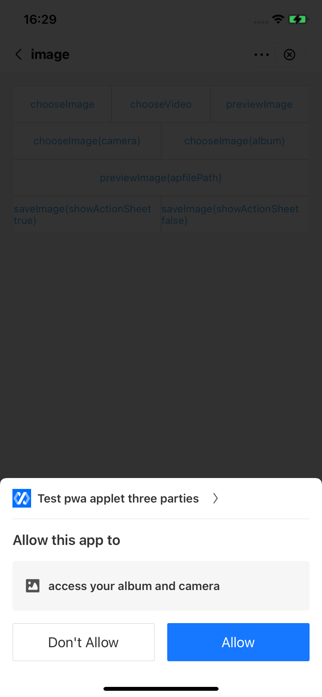

## Personalizar las vistas de autorización del usuario

Para preocupaciones de privacidad, IAPminiprogram SDK muestra vistas de autorización de usuarios cuando los mini programas llaman a JSAPIS que requieren acceso a la información confidencial de los usuarios. La super aplicación puede personalizar estas vistas para crear una interfaz de usuario que coincida con su marca y cumpla con los requisitos regionales regionales.Este tema lo guía a través de cómo personalizar la vista de autorización del usuario.


## Experiencia de usuario predeterminada

Si elige no proporcionar vistas personalizadas de autorización de usuario, el SDK muestra las vistas en forma de una ventana emergente inferior en la pantalla. Puede consultar la siguiente imagen para obtener un ejemplo de vista predeterminado:




## procedimientos
Tome los siguientes tres pasos para personalizar sus vistas de autorización:

## Paso 1: Implementar LocalPermissionDialog
Cree una clase que implique la interfaz localPermissionDialog para definir su vista personalizada.Consulte el siguiente código de muestra para la implementación:

```js
public class DemoLocalPermissionNoticeDialog implements LocalPermissionDialog {
    private Context context;
    private String content;
    private String name;
    private String iconUrl;
    private List<String> scopes;
    private final Map<String, String> authContentMap = new HashMap<>();
    private PermissionPermitListener listener;

    public DemoLocalPermissionNoticeDialog(Context context) {
        this.context = context;
        authContentMap.put("scope.camera", GriverEnv.getResources().getString(R.string.griver_access_your_camera));
        authContentMap.put("scope.album", GriverEnv.getResources().getString(R.string.griver_access_your_album));
        authContentMap.put("scope.location",GriverEnv.getResources().getString(R.string.griver_access_your_current_location));
    }


    @Override
    public void setDialogContent(String content, String name, String iconUrl) {
        this.content = content;
        this.name = name;
        this.iconUrl = iconUrl;
    }

    @Override
    public void setDialogExtraData(Map<String, String> map) {
        String scope = map.get("scopes");
        if (!TextUtils.isEmpty(scope)) {
            List<String> authScopes = JSON.parseArray(scope, String.class);
            if (authScopes != null) {
                scopes.addAll(authScopes);
            }
        }
    }

    @Override
    public void setPermissionPermitListener(PermissionPermitListener permissionPermitListener) {
        this.listener = permissionPermitListener;
    }

    @Override
    public void show() {
        CreateDialogParam createDialogParam = new CreateDialogParam(name, content,
                context.getString(R.string.griver_core_allow),
                context.getString(R.string.griver_core_deny), null);
        createDialogParam.cancelable = false;
        createDialogParam.positiveListener = new DialogInterface.OnClickListener() {
            @Override
            public void onClick(DialogInterface dialogInterface, int i) {
                listener.onSuccess();
            }
        };
        createDialogParam.negativeListener = new DialogInterface.OnClickListener() {
            @Override
            public void onClick(DialogInterface dialogInterface, int i) {
                listener.onFailed(-1, context.getString(R.string.griver_core_user_unauthorized), true);
            }
        };
        RVProxy.get(GriverDialogExtension.class).createDialog(GriverEnv.getTopActivity().get(),
                createDialogParam).show();
    }
}

```


Para obtener más información sobre esta interfaz, consulte ```LocalPermissionDialog```.

##Paso 2: implementar GriverLocalAuthDialogExtension
Cree una clase que implementa la interfaz ```GriverLocalAuthDialogExtension``` para crear una vista que se define en el paso anterior. Consulte el siguiente código de muestra para la implementaciónn:

  ```js
public class GriverLocalAuthDialogExtensionImpl implements GriverLocalAuthDialogExtension {
    @Override
    public LocalPermissionDialog createDialog(Context context) {
        return new DemoLocalPermissionNoticeDialog(context);
    }
}
```

Para obtener más información sobre esta interfaz, consulte ```[GriverLocalAuthDialogExtension](/)```.


## Paso 3: Registre GriverLocalAuthDialogExtension
Después de la lógica de inicialización de SDK, llame a la API **registerExtension** de Registro para registrar la interfaz ```GriverLocalAuthDialogExtension``` implementada al SDK con el siguiente código de muestra:

```js
Griver.registerExtension(new GriverExtensionManifest(GriverLocalAuthDialogExtension.class, new GriverLocalAuthDialogExtensionImpl()));
For how to call the registerExtension API, refer to registerExtension.
```

## interfaces

## LocalPermissionDialog
La interfaz ```LocalPermissionDialog``` se utiliza para personalizar la vista de autorización del usuario que está asociada con un JSAPI específico. El siguiente código muestra la definición de esta interfaz:

```js
public interface LocalPermissionDialog {
    void setDialogContent(String content, String name, String iconUrl);
    void setDialogExtraData(Map<String, String> params);
    void setPermissionPermitListener(PermissionPermitListener listener);
    void show(Page page);
}
```
Como podemos ver en la definición, esta interfaz proporciona los siguientes cuatro métodos:


<table>
    <tr>
        <th>
          Método
        </th>
        <th>
            Descripción
        </th>
        <th>
            Requerido
        </th>
    </tr>
    <tr>
        <td>
            setDialogContent
        </td>
        <td>
        La super aplicación utiliza este método para obtener la información en una vista predeterminada y personalizar la visualización de una vista de autorización de usuario.Para obtener más información, consulte SetDialogContent.
        </td>
        <td>
            M
        </td>
    </tr>
    <tr>
        <td>
            setDialogExtraData
        </td>
        <td>
           La super aplicación utiliza este método para obtener la información que podría ser necesaria para una vista de autorización del usuario.Para obtener más información, consulte SetDialogExtradata.
        </td>
        <td>
            O
        </td>
    </tr>
    <tr>
        <td>
            setPermissionPermitListener
        </td>
        <td>
          La super aplicación utiliza este método para establecer un oyente para manejar la respuesta del usuario sobre si aprueba o niega la autorización.Para obtener más información, consulte SetPermissionPermitListener.
        </td>
        <td>
            M
        </td>
    </tr>
    <tr>
        <td>
            show
        </td>
        <td>
           El SDK llama a este método para mostrar la vista personalizada en la página actual cuando se activa el JSAPI.Para obtener cómo especificar su parámetro, consulte Show.
        </td>
        <td>
            M
        </td>
    </tr>

</table>


## setDialogContent
El método ```SetDialogContent``` tiene los siguientes parámetros de entrada cuyos valores pasan el SDK:


<table>
    <tr>
        <th>
            Campo
        </th>
        <th>
            Tipo de datos
        </th>
        <th>
            Descripción
        </th>
        <th>
         Requerida
        </th>
    </tr>
    <tr>
        <td>
            content
        </td>
        <td>
            String
        </td>
        <td>
            La descripción del alcance en la vista predeterminada. Para una ilustración visual, consulte la ilustración de la vista de autorización del usuario.
        </td>
        <td>
            M
        </td>
    </tr>
    <tr>
        <td>
            name
        </td>
        <td>
            String
        </td>
        <td>
          El mensaje de permiso en la vista predeterminada. Para una ilustración visual, consulte la ilustración de la vista de autorización del usuario.
        </td>
        <td>
            M
        </td>
    </tr>
    <tr>
        <td>
            iconUrl
        </td>
        <td>
            String
        </td>
        <td>
           La URL del icono en la vista predeterminada.Para una ilustración visual, consulte la ilustración de la vista de autorización del usuario.
        </td>
        <td>
            M
        </td>
    </tr>
</table>


## setDialogExtraData
El método ```setDialogExtraData``` tiene el siguiente parámetro de entrada cuyo valor pasa por el SDK:


<table>
    <tr>
        <th>
Field
        </th>
        <th>
Data type
        </th>
        <th>
Description
        </th>
        <th>
Required
        </th>
    </tr>
    <tr>
        <td>
            params
        </td>
        <td>
            ```Map<String, String>```
        </td>
        <td>
            The additional information of the authorization view. This parameter is specified in key-value pairs with the following valid key:
            <ul>
                <li>
                    Scopes: ```Required``` Los ámbitos que requieren autorización del usuario cuando los mini programas llaman a un JSAPI específico.Esta clave es una matriz de cadenas con los siguientes valores válidos:
                    <ul>
                        <li>
                            scope.album: El JSAPI requiere acceso al álbum del usuario.
                        </li>
                        <li>
                            scope.camera: El JSAPI requiere acceso a la cámara del usuario.
                        </li>
                        <li>
                            scope.location: El JSAPI requiere acceso a la ubicación del usuario.
                        </li>
                    </ul>
                Para obtener cómo se asignan los valores, consulte [cómo se especifica el parámetro Scopes](/).
                </li>
            </ul>
        </td>
        <td>
        </td>
    </tr>
</table>


## setPermissionPermitListener
El método ```setPermissionPermitListener``` tiene el siguiente parámetro de entrada cuyo valor pasa por el SDK:


<table>
    <tr>
        <th>
            Campo
        </th>
        <th>
            Tipo de datos
        </th>
        <th>
            Descripción
        </th>
        <th>
            Requerido
        </th>
    </tr>
    <tr>
        <td>
            listener
        </td>
        <td>
            PermissionPermitListener
        </td>
        <td>
           Un oyente que captura la respuesta del usuario sobre si acepta o cancelan la autorización.Para obtener más información, consulte PermissionPermitListener.
        </td>
        <td>
            M
        </td>
    </tr>
</table>


## PermissionPermitListener

<table>
    <tr>
        <th>
            Método
        </th>
        <th>
            Descripción
        </th>
    </tr>
    <tr>
        <td>
            onSuccess
        </td>
        <td>
           La super aplicación debe llamar a este método para notificar al SDK cuando el usuario aprueba la autorización.
        </td>
    </tr>
    <tr>
        <td>
            onFailed
        </td>
        <td>
          La super aplicación debe llamar a este método para notificar al SDK cuando el usuario niega la autorización.
        </td>
    </tr>
</table>


## show
La super aplicación debe especificar el siguiente parámetro de entrada correctamente para el método ```show```:


<table>
    <tr>
        <th>
            Field
        </th>
        <th>
            Data type
        </th>
        <th>
            Description
        </th>
        <th>
            Required
        </th>
    </tr>
    <tr>
        <td>
            page
        </td>
        <td>
            Page
        </td>
        <td>
            An instance of the current page.
        </td>
        <td>
            M
        </td>
    </tr>
</table>


## GriverLocalAuthDialogExtension

La interfaz ```GriverLocalAuthDialogExtension``` se utiliza para crear una vista de autorización del usuario que está definida por la interfaz ```LocalPermissionDialog```. El siguiente código muestra la definición de esta interfaz:

```JS
public interface GriverLocalAuthDialogExtension extends GriverExtension {
    LocalPermissionDialog createDialog(Context context);
}
```

Como podemos ver en la definición, esta interfaz proporciona el siguiente método:


<table>
    <tr>
        <th>
            Method
        </th>
        <th>
            Description
        </th>
        <th>
            Required
        </th>
    </tr>
    <tr>
        <td>
            createDialog
        </td>
        <td>
            The SDK calls this method to create a user authorization view that is defined by the LocalPermissionDialog interface. For more information, refer to createDialog.
        </td>
        <td>
            M
        </td>
    </tr>
</table>


## createDialog

El método createDialog tiene el siguiente parámetro de entrada cuyo valor pasa por el SDK:


<table>
    <tr>
        <th>
            Field
        </th>
        <th>
            Data type
        </th>
        <th>
            Description
        </th>
        <th>
            Required
        </th>
    </tr>
    <tr>
        <td>
            context
        </td>
        <td>
            Context
        </td>
        <td>
            Interface to global information about an application environment.
        </td>
        <td>
            M
        </td>
    </tr>
</table>


