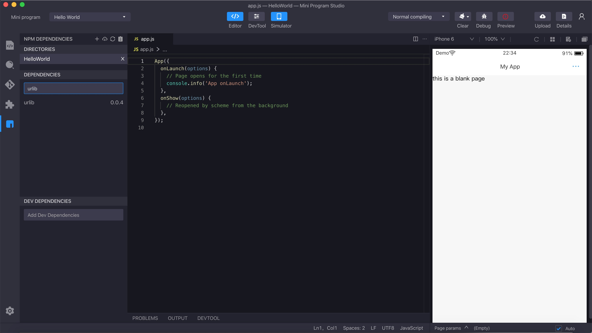

# NPM Package Management

The developer can manage easily all NPM dependencies in the current project within the Mini Program Studio. The entry is shown in the figure below.




## Configuration Workspace

### Espacio de trabajo predeterminado

El Mini Program Studio crea automáticamente el espacio de trabajo predeterminado en función de la ruta del archivo ```package.json``` en el directorio actual. Si el ```package.json``` se encuentra en el proyecto actual, mostrará el espacio de trabajo predeterminado como se muestra arriba. Si el ```package.json``` no se encuentra en la ruta raíz del proyecto, mostrará un espacio de trabajo vacío. Luego debe hacer clic en la ```Add Folder``` para agregar la ruta de la raíz manualmente. Luego, el Mini Program Studio creará un archivo ```package.json``` en la ruta raíz automáticamente.


## Gestión de dependencias

En la interfaz de administración de paquetes NPM, puede administrar las dependencias.


<ul>
    <li>
        Instale la dependencia específica: ingrese el nombre de dependencia en el cuadro de entrada y presione ```ENTER``` para instalar la dependencia. Hay dos opciones para instalar dependencias. Los paquetes de NPM instalados en el área de ```Dependencies``` irán a la producción y los paquetes de NPM instalados en ```DEV DEPENDENCIES``` solo funcionan para el entorno de desarrollo.
    </li>
    <li>
        Instale todas las dependencias: haga clic en el botón Instalar todas las dependencias para instalar todas las dependencias.

        
    </li>
    <li>
        Eliminar dependencia: haga clic en el botón Eliminar para eliminar la dependencia específica. 
        
        
    </li>
</ul>


